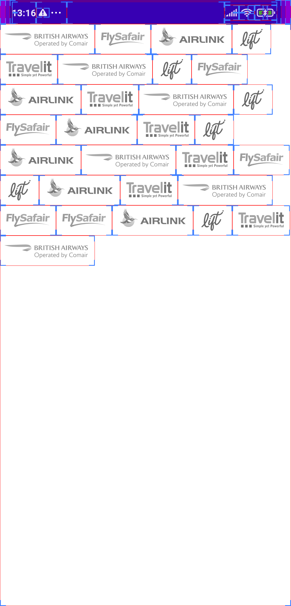
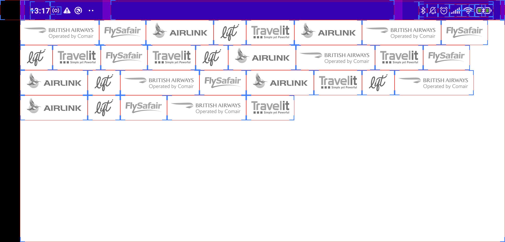

# TravelT: Proof of concept

## Screenshots

&nbsp;

<br/>


## Videos

<video controls src="./screenshots/device-2021-11-18-131742.mp4" width=50%></vidoe>

## Solution

This sample application is a proof of concept that uses a [flexbox layout manager](https://github.com/google/flexbox-layout) with a recycler (view, adapter, viewholder) to render a list of images with unknown dimensions at runtime which allows us to wrap and overflow based on device dimensions.

### Setup

When using a `FlexboxLayoutManager` there is no need to override any of the recycler adapters methods for resolving sizing constraints for each layout pass which could be the case when using a staggered layout manager, simply do the following:   

```kotlin
    private fun setUpRecycler() {
        val flexboxLayoutManager = FlexboxLayoutManager(
            applicationContext,
            FlexDirection.ROW,
            FlexWrap.WRAP
        )

        with (requireBinding()) {
            recyclerView.layoutManager = flexboxLayoutManager
            recyclerView.adapter = imageAdapter
        }
    }
```

```kotlin
    private fun onData(content: List<Content>) {
        imageAdapter.submitList(content)
    }
    
    private fun setUpViewModelObservers() {
        viewModel.model.observe(this) {
            onData(it)
        }
        viewModel.loading.observe(this) {
            if (it) {
                requireBinding().recyclerView.gone()
                requireBinding().loadingSpinner.visible()
            }
            else {
                requireBinding().loadingSpinner.gone()
                requireBinding().recyclerView.visible()
            }
        }
    }
```

> The rest of the implementation would follow the standard recycler view approach.